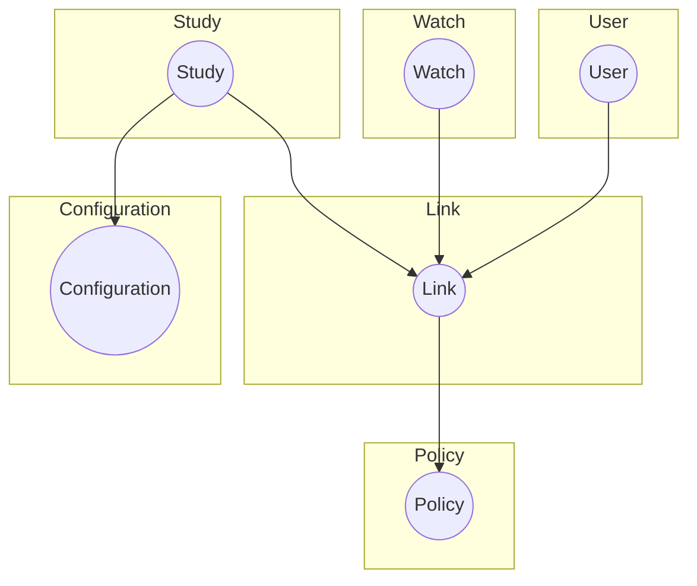

# DevDocs

_This documentation details the functionalities and API calls within Experiencer_

## API Calls

### Authentiaction

1. Get Token

   Experiencer requires a user auth token to communicate to the server in order to send and receive data.

`curl --location 'BASE_URL/oauth/token'
--header 'Authorization: Basic TOKEN'
--header 'Content-Type: application/x-www-form-urlencoded'
--data-urlencode 'grant_type=password'
--data-urlencode 'username=EMAIL'
--data-urlencode 'password=PASSWORD'`

- Response structure (200 OK)

  The following is received when EMAIL and PASSWORD are correct

`{"access_token": "REMOVED FOR PRIVACY",
"token_type": "REMOVED FOR PRIVACY",
"refresh_token": "REMOVED FOR PRIVACY",
"expires_in": "REMOVED FOR PRIVACY",
"scope": "REMOVED FOR PRIVACY",
"jti": "REMOVED FOR PRIVACY"
}`

- Response structure (400 Bad Request)

  The following is received when EMAIL or/and PASSWORD is/are wrong

`{
    "error": "invalid_grant",
    "error_description": "Bad credentials"
}`

2. Connect a watch to a user and a study

   A user of Experiencer requires an explicit connection between the device (that Experiencer is installed on and is identified by [REGISTER_ID](https://docs.tizen.org/application/web/guides/messaging/push/#registering-to-the-push-service)) and a study.

   A user is identified by the token received from step 1. The [REGISTER_ID](https://docs.tizen.org/application/web/guides/messaging/push/#registering-to-the-push-service) is fetched programatically within Experiencer and visualized by a QR code on the home screen of Experiencer.

   A study is defined by the principal investigator of the research (an alphanumeric string)

`curl --location 'BASE_URL/wearables/tizen/register/study?policy=POLICY'
--header 'Content-Type: application/json'
--header 'Authorization: Bearer TOKEN'
--data '{"registerId": "REGISTER_ID","study": "STUDY_NAME"}'`

- Response structure (200 OK)

`{
    "id": REMOVED FOR PRIVACY (WAS INT),
    "registerId": "5REMOVED FOR PRIVACY",
    "registeredAt": REMOVED FOR PRIVACY (WAS TS IN MS)
}`

- Response structure (422 Unprocessable Entity)
