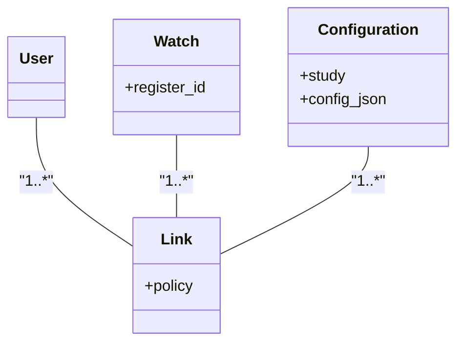
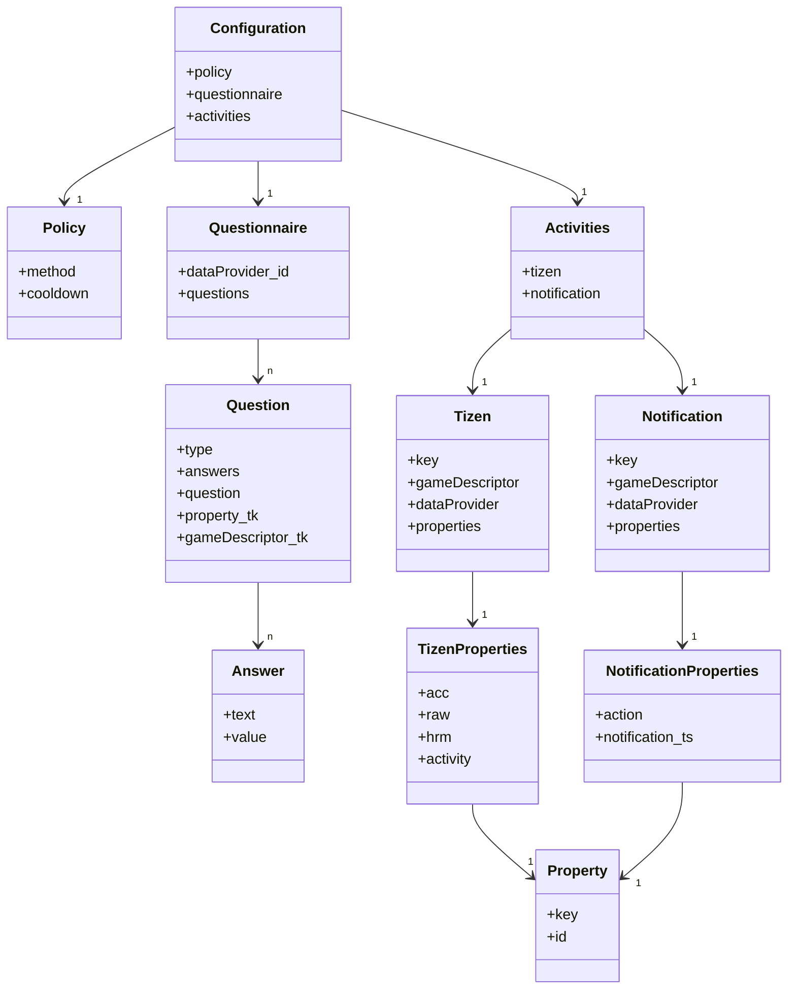

# 👩‍💻 DevDocs

_This documentation details the functionalities and API calls within Experiencer_

## 🧱 Environment setup

- [Installing Tizen studio](https://docs.tizen.org/application/tizen-studio/setup/install-sdk/)
- [Creating application project](https://docs.tizen.org/application/web/tutorials/process/creating-app-project/)
- [Web application samples](https://docs.tizen.org/development/sample/web)

## 🌐 API Calls

### 👮‍♂️ Authentiaction

1. Get Token

   Experiencer requires a user auth token to communicate to the server in order to send and receive data.

`curl --location 'BASE_URL/oauth/token'
--header 'Authorization: Basic TOKEN'
--header 'Content-Type: application/x-www-form-urlencoded'
--data-urlencode 'grant_type=password'
--data-urlencode 'username=EMAIL'
--data-urlencode 'password=PASSWORD'`

- Response structure (200 OK)

  The following JSON is received when EMAIL and PASSWORD are correct

`{"access_token": "REMOVED FOR PRIVACY",
"token_type": "REMOVED FOR PRIVACY",
"refresh_token": "REMOVED FOR PRIVACY",
"expires_in": "REMOVED FOR PRIVACY",
"scope": "REMOVED FOR PRIVACY",
"jti": "REMOVED FOR PRIVACY"
}`

- Response structure (400 Bad Request)

  The following is received when EMAIL or/and PASSWORD is/are wrong

`{
    "error": "invalid_grant",
    "error_description": "Bad credentials"
}`

**Since our BASE_URL connects to GameBus API, please see [GameBus DevDocs](https://devdocs.gamebus.eu/) for the latest base url and also an in-depth explanation of token endpoint.**

2. Connect a watch to a user and a study

   A user of Experiencer requires an explicit connection between the device (that Experiencer is installed on and is identified by [REGISTER_ID](https://docs.tizen.org/application/web/guides/messaging/push/#registering-to-the-push-service)) and a study.

   A user is identified by the token received from step 1. The [REGISTER_ID](https://docs.tizen.org/application/web/guides/messaging/push/#registering-to-the-push-service) is fetched programatically within Experiencer and visualized by a QR code on the home screen of Experiencer.

   A STUDY_NAME (an alphanumeric string) and configuration is defined by the principal investigator

   A POLICY is chosen by the principal investigator

- v4.0.1: ALL, KNOWN, UNKNOWN, and ML policies can be chosen.

`curl --location 'BASE_URL/wearables/tizen/register/study?policy=POLICY'
--header 'Content-Type: application/json'
--header 'Authorization: Bearer TOKEN'
--data '{"registerId": "REGISTER_ID","study": "STUDY_NAME"}'`

- Response structure (200 OK)

  The following response is received when the correct information is passed.

  Calling this API sends a push notification to the watch that includes the user token

`{
    "id": REMOVED FOR PRIVACY (WAS INT),
    "registerId": "5REMOVED FOR PRIVACY",
    "registeredAt": REMOVED FOR PRIVACY (WAS TS IN MS)
}`

- Response structure (422 Unprocessable Entity)

  In case the push notification does not go through (due to Samsung push service being down or watch screen being off) the same requst can be repeated. Repeating the request would respond with an empty body and status code 422 if the link is already existing and push command is resent.

### Push Notification Structure (for the auth token)

1. Raw request (the request is currently handled by GameBus API when calling the endpoint in step 2)

`curl --location 'https://euwest.gateway.push.samsungosp.com:8090/spp/pns/api/push' 
--header 'appID: APP_ID' 
--header 'appSecret: APP_SECRET' 
--header 'Content-Type: application/json' 
--data '{
    "regID": "REGISTER_ID",
    "requestID": "REMOVED FOR PRIVACY (WAS 7-DIGIT INT)",
    "sender": "REMOVED FOR PRIVACY",
    "type": "0",
    "message": "badgeOption=INCREASE&badgeNumber=1&action=LAUNCH&alertMessage=REMOVED FOR PRIVACY",
    "appData": "{\"token\":\"TOKEN\"}",
    "sessionInfo": "REMOVED FOR PRIVACY (WAS 6-DIGIT INT)",
    "timeStamp": REMOVED FOR PRIVACY (WAS TS IN S)
}'`

For more information about the push notification visit [Push Notification | Tizen Docs](https://docs.tizen.org/application/web/guides/messaging/push/).

- v4.0.1: `pushNotificationCallback(notification)` function in [`/src/js/app.js`](/src/js/app.js) parses this information and saves the token (`appData.token`).

### Configuration Retrieval

Experiencer consumes a JSON-formatted configuration to operate. Retrieval of a configuration is handled by `getConfig()` in [`/src/js/app.js`](/src/js/app.js).

1. Get config

`curl --location 'BASE_URL/wearables/tizen/config?registerId=REGISTER_ID'
--header 'Authorization: Bearer TOKEN'`

- Response structure (200 OK)

Example configurations are available at [`/examples/configuration`](https://github.com/khnshn/Experiencer/tree/main/examples/configuration)

- v4.0.1: The following class diagrams illustrates the schema of JSON-fromatted configuration as-is and as-consumed.

### Data transfer

Experiencer collects then sends the data to GameBus as [GameBus activities](https://devdocs.gamebus.eu/).

## 🛠 Applicatoin Logic

### v4.0.1 (Tizen OS v5.5, Web API, TensorFlow, IndexedDB)

- For base urls and global constants alike see [`/src/config/gb.js`](/src/config/gb.js)
- Experiencer is developed as an application with background network process.
- Experiencer is continuously running in the background. To achieve this with Web API, [Alarm API](https://docs.tizen.org/application/web/api/5.5/device_api/wearable/tizen/alarm.html) is utilized and restarts the app every ~15 minutues to avoid OS battery drainage warning.
- Experiencer listens to [Pedometer](https://docs.tizen.org/application/web/api/5.5/device_api/wearable/tizen/humanactivitymonitor.html#PedometerStepStatus) change events every minute. This serves as the foundation of sending notifications as this is a way to (almost) make sure that a user is wearing the watch.
- Experience is made for context sensitivity accordingly [HumanActivityMonitor API](https://docs.tizen.org/application/web/api/5.5/device_api/wearable/tizen/humanactivitymonitor.html#HumanActivityPedometerData) is utilized to detect `{ "NOT_MOVING", "WALKING", "RUNNING", "UNKNOWN" }` activities.
- The policies defined in this version are "KNOWN" (`{ "NOT_MOVING", "WALKING", "RUNNING" }`), "UNKNOWN" (`{ "UNKNOWN" }`), ALL (`{ "NOT_MOVING", "WALKING", "RUNNING", "UNKNOWN" }`) and ML (see below). Respective conditions are define in [`/src/js/app.js`](/src/js/app.js) such that if e.g., a user is assigend "KNOWN" policy, notifications will be made only when any of `{ "NOT_MOVING", "WALKING", "RUNNING" }` are detected.
- The notifications are sent according to an inter-notification time (named "cooldown" in the JSON-formatted config). When a notification is sent, the logic above goes to sleep until the `current_time >= last_notification_time + cooldown`.
- For ML policy, Experiencer downloads a trained TensorFlow binary classifier and consults with before sending a notification. If `prediction <= 0.5` is met a notification is not sent, otherwise it is.
- Experiencer utilizes [TensorFlow.js](https://www.tensorflow.org/js) library to download the model, make inferences, and update the model. The downloaded model is updated based on the user behavior. All relevant logic can be found in [`/src/lib/gb/download_handler.js`](/src/lib/gb/download_handler.js), [`/src/lib/gb/tensoer_handler.js`](/src/lib/gb/tensoer_handler.js), and [`/src/js/app.js`](/src/js/app.js)
- The feature processing for updating the TensorFlow model is handled in the `function preprocess_1x16(time_since_start,time_since_prev_beep,speed,prev_reaction_to_beep,current_pa)` function in [`/src/js/app.js`](/src/js/app.js).
- The label of the feature vector produced above is 0 when a moment is inopportune (meaning that the participant has not reacted to the last notification within `OPPORTUNE_WINDOW`) otherwise it is 1.
- The network operations for sending the self-report and physiological data is handled in [`/src/lib/gb/webservice.js`](/src/lib/gb/webservice.js). Every `WIFI_INTERVAL` the webservice queues the data that is stored on the watch and transfers them to GameBus sequentially. Upon a successful transaction, the data is deleted from the watch.
- All the data is stored on the watch using IndexedDB the operations of which are all handled in [`/src/lib/gb/webservice.js`](/src/lib/gb/webservice.js).
- Experiencer relies on push notifications only for authentiaction purposes. The notifications for self-report are initiated from the app itself and not from a push server. That is to ensure that the app can function offline as well. This is crucial since it is not realistic to expect users to be online all the time.
- Experiencer records [acceleration, PPG (HRM_RAW)](https://docs.tizen.org/application/web/api/5.5/device_api/wearable/tizen/sensor.html), [heart-rate and peak-to-peak](https://docs.tizen.org/application/web/guides/sensors/ham/) interval only during the time that a self-report action is initiated (by tapping the self-report button) and continues recording until the self-report is submitted but for a maximum of `SENSOR_RECORDING` (defined in [`/src/config/gb.js`](/src/config/gb.js)).
- The contents of the questionnaire (that is shown after tapping the self-report button) is fetched from the configurations (see [Configuration Retrieval](#configuration-retrieval)) and is visualized through [`/src/lib/gb/questionnaireHelper.js`](/src/lib/gb/questionnaireHelper.js).

## ✅ To Do List

### For the Tizen OS version (will be depricated)

- Remove older tensorflow models when a new one is downloaded.

### Develop a WearOS version with the following specifications:

- Utilize Samsung Privilleged SDK for ECG and SpO2 data access.
- Include a [service](https://developer.android.com/develop/background-work/services) to handle background operations.
- Follow the [GameBus developer portal guidelines](https://devdocs.gamebus.eu/gamebus-developer-portal/) for authentican and data transfer.
