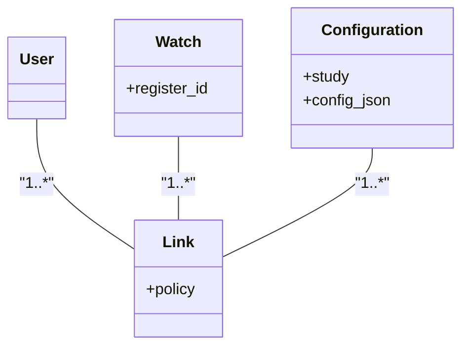

# DevDocs

_This documentation details the functionalities and API calls within Experiencer_

## API Calls

### Authentiaction

1. Get Token

   Experiencer requires a user auth token to communicate to the server in order to send and receive data.

`curl --location 'BASE_URL/oauth/token'
--header 'Authorization: Basic TOKEN'
--header 'Content-Type: application/x-www-form-urlencoded'
--data-urlencode 'grant_type=password'
--data-urlencode 'username=EMAIL'
--data-urlencode 'password=PASSWORD'`

- Response structure (200 OK)

  The following JSON is received when EMAIL and PASSWORD are correct

`{"access_token": "REMOVED FOR PRIVACY",
"token_type": "REMOVED FOR PRIVACY",
"refresh_token": "REMOVED FOR PRIVACY",
"expires_in": "REMOVED FOR PRIVACY",
"scope": "REMOVED FOR PRIVACY",
"jti": "REMOVED FOR PRIVACY"
}`

- Response structure (400 Bad Request)

  The following is received when EMAIL or/and PASSWORD is/are wrong

`{
    "error": "invalid_grant",
    "error_description": "Bad credentials"
}`

**Since our BASE_URL connects to GameBus API, please see [GameBus DevDocs](https://devdocs.gamebus.eu/) for the latest base url and also an in-depth explanation of token endpoint.**

2. Connect a watch to a user and a study

   A user of Experiencer requires an explicit connection between the device (that Experiencer is installed on and is identified by [REGISTER_ID](https://docs.tizen.org/application/web/guides/messaging/push/#registering-to-the-push-service)) and a study.

   A user is identified by the token received from step 1. The [REGISTER_ID](https://docs.tizen.org/application/web/guides/messaging/push/#registering-to-the-push-service) is fetched programatically within Experiencer and visualized by a QR code on the home screen of Experiencer.

   A STUDY_NAME (an alphanumeric string) and configuration is defined by the principal investigator

   A POLICY is chosen by the principal investigator

- v4.0.1: ALL, KNOWN, UNKNOWN, and ML policies can be chosen.

`curl --location 'BASE_URL/wearables/tizen/register/study?policy=POLICY'
--header 'Content-Type: application/json'
--header 'Authorization: Bearer TOKEN'
--data '{"registerId": "REGISTER_ID","study": "STUDY_NAME"}'`

- Response structure (200 OK)

  The following response is received when the correct information is passed.

  Calling this API sends a push notification to the watch that includes the user token

`{
    "id": REMOVED FOR PRIVACY (WAS INT),
    "registerId": "5REMOVED FOR PRIVACY",
    "registeredAt": REMOVED FOR PRIVACY (WAS TS IN MS)
}`

- Response structure (422 Unprocessable Entity)

  In case the push notification does not go through (due to Samsung push service being down or watch screen being off) the same requst can be repeated. Repeating the request would respond with an empty body and status code 422 if the link is already existing and push command is resent.

### Push Notification Structure (for the auth token)

1. Raw request (the request is currently handeled by GameBus API when calling the endpoint in step 2)

`curl --location 'https://euwest.gateway.push.samsungosp.com:8090/spp/pns/api/push' 
--header 'appID: APP_ID' 
--header 'appSecret: APP_SECRET' 
--header 'Content-Type: application/json' 
--data '{
    "regID": "REGISTER_ID",
    "requestID": "REMOVED FOR PRIVACY (WAS 7-DIGIT INT)",
    "sender": "REMOVED FOR PRIVACY",
    "type": "0",
    "message": "badgeOption=INCREASE&badgeNumber=1&action=LAUNCH&alertMessage=REMOVED FOR PRIVACY",
    "appData": "{\"token\":\"TOKEN\"}",
    "sessionInfo": "REMOVED FOR PRIVACY (WAS 6-DIGIT INT)",
    "timeStamp": REMOVED FOR PRIVACY (WAS TS IN S)
}'`

For more information about the push notification visit [Push Notification | Tizen Docs](https://docs.tizen.org/application/web/guides/messaging/push/).

- v4.0.1: `pushNotificationCallback(notification)` function in `app.js` parses this information and saves the token (`appData.token`).

### Configuration Retrieval

Experiencer consumes a JSON-formatted configuration to operate. Retrieval of a configuration is handeled by `getConfig()` in `app.js`.

1. Get config

`curl --location 'BASE_URL/wearables/tizen/config?registerId=REGISTER_ID'
--header 'Authorization: Bearer TOKEN'`

- Response structure (200 OK)

For example configurations check our [`/examples/configuration`](https://github.com/khnshn/Experiencer/tree/main/examples/configuration)

PUT ALL EXPERIENCER DOCUMENTATIONS HERE!!!

WISH LIST
